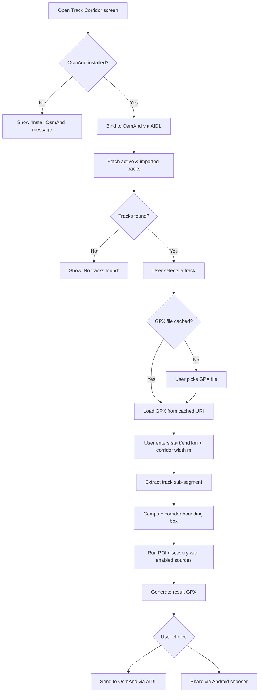

# Track Corridor Workflow

```mermaid
flowchart TD
    A[Open Track Corridor screen] --> B{OsmAnd installed?}
    B -- No --> B1[Show 'Install OsmAnd' message]
    B -- Yes --> C[Bind to OsmAnd via AIDL]
    C --> D[Fetch active & imported tracks]
    D --> E{Tracks found?}
    E -- No --> E1[Show 'No tracks found']
    E -- Yes --> F[User selects a track]
    F --> G{GPX file cached?}
    G -- Yes --> H[Load GPX from cached URI]
    G -- No --> I[User picks GPX file]
    I --> H
    H --> J[User enters start/end km + corridor width m]
    J --> K[Extract track sub-segment]
    K --> L[Compute corridor bounding box]
    L --> M[Run POI discovery with enabled sources]
    M --> N[Generate result GPX]
    N --> O{User choice}
    O --> P[Send to OsmAnd via AIDL]
    O --> Q[Share via Android chooser]
```
